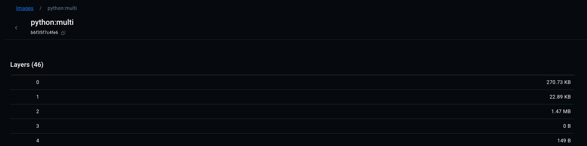

### Build base node

```sh
docker build -t express:node .
```

checking size

```sh
╰─❯ docker images
REPOSITORY   TAG       IMAGE ID       CREATED          SIZE
express      node      0b99ed2c2491   17 seconds ago   1.13GB
```

### 1. Build from smaller base

```sh
docker build -f Dockerfile.smallbase -t express:alpine .
```

checking size

```sh
docker images
REPOSITORY   TAG       IMAGE ID       CREATED          SIZE
express      alpine    76c960527de4   54 seconds ago   172MB
```

### 2. Multi stage build

```sh
docker build -f Dockerfile.multi -t express:multi .
```

checking size

```sh
╰─❯ docker images
REPOSITORY   TAG       IMAGE ID       CREATED          SIZE
express      multi     2d594cacf35f   6 seconds ago    165MB
```

### 3. Google Distroless Images + Multistage

```sh
docker build -f Dockerfile.distroless -t express:distro .
```

checking size

```sh
❯ docker images
REPOSITORY   TAG       IMAGE ID       CREATED              SIZE
express      distro    5720b06f74af   About a minute ago   156MB
```

### 4. dockerignore

```sh
node_modules
.git
*.log
```

checking size

```sh
❯ docker images
REPOSITORY   TAG       IMAGE ID       CREATED              SIZE
express      distro    5720b06f74af   About a minute ago   156MB
```

### 6. Minimize Layers

Building withot minizing layer with our best mult stage docker with distroless image

```sh
docker build -t python:multi .
```

checking size before adjusting layers

```sh
─❯ docker images
REPOSITORY   TAG       IMAGE ID       CREATED         SIZE
python       multi     b6f35f7c4fe6   5 seconds ago   88.6MB
```


46 layer before

checking size after adjust the layers on the RUN command.

```sh
 docker images
REPOSITORY   TAG       IMAGE ID       CREATED          SIZE
python       base      dd1ec8b15964   25 seconds ago   88.6MB
```

No much significant change since we are using multi stage build, the affected layers are on the build step which wont afffect our result here, since we will use the last base image.

- Lets check another image say a custom github runnner image:

```sh
docker build -t ubuntu:22 .
```

let check size

```sh
─❯ docker images
REPOSITORY   TAG       IMAGE ID       CREATED         SIZE
ubuntu       22        9dbb59097a2d   8 seconds ago   204MB
```

after optimized build

```sh
docker build -f Dockerfile.layersoptimal -t ubuntu:optimal .
```

check size after

```sh
docker images
REPOSITORY   TAG       IMAGE ID       CREATED         SIZE
ubuntu       optimal   9d013bb6aae5   6 seconds ago   144MB
```

### 6. Scratch Distroless Base (True distroless)(Advanced)

- Works Your app is a self-contained binary (e.g., Go, Rust, C/C++).
  Building without scratch.

```sh
docker build -t go:multi .
```

checking size

```sh
docker images
REPOSITORY   TAG       IMAGE ID       CREATED         SIZE
go           multi     9460cedbb9e4   4 seconds ago   3.94MB
```
